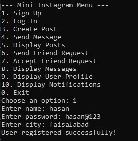
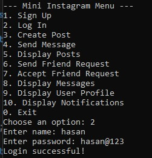
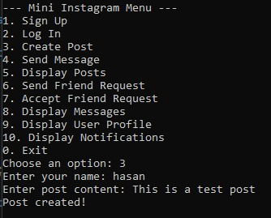
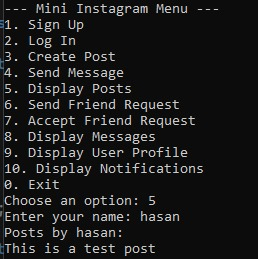
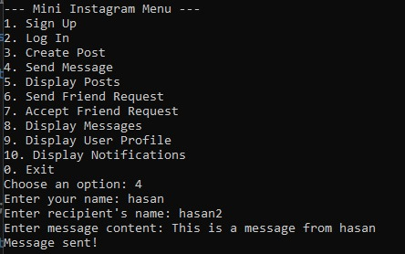
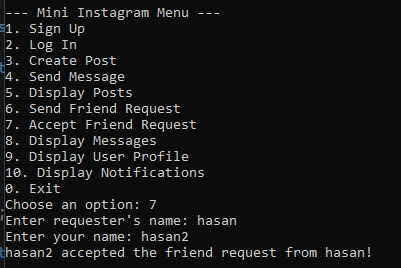

# 📱 Mini Instagram (C++ Data Structures Project)

A console-based application demonstrating core social media features using efficient data structures.

[](https://en.cppreference.com/)
[]()

## 🎥 Project Demo
<div align="center">
  
   
  <br>
  
  
  
</div>

## ✨ Core Features
### 🧑 User System
- Registration with username/password
- Profile management (city, friends list)
- Secure login authentication

### 📝 Content Management
- Post creation (Linked List implementation)
- Message system (Linked List)
- Friend request queue (FIFO processing)

### 🔔 Notification System
- Real-time activity alerts
- Queue-based notification delivery

## 🛠️ Implementation Highlights
```cpp
// Memory-efficient linked list for posts
struct Post {
    string content;
    Post* next;  // O(1) insertion
};

// Friend request queue
struct FriendRequest {
    string requester;
    FriendRequest* next;  // FIFO processing
};

// O(1) notification insertion
void addNotification(string msg) {
    Notification* newNotif = new Notification(msg, notificationQueue);
    notificationQueue = newNotif;
}

